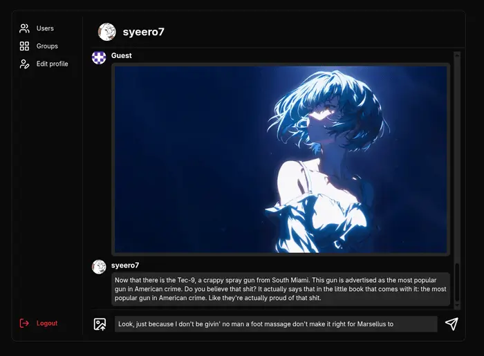

# Deliverer

Real-time messaging app built using React.



## Getting Started

Clone the repository

```bash
git clone https://github.com/syeero7/odin-msg-app
cd odin-msg-app
```

Install dependencies

```bash
npm install
```

Configure [environment variables](#environment-variables)

Run migrations

```bash
npx prisma migrate dev
```

Start development servers

```bash
# backend
npm run dev:backend

# frontend
npm run dev:frontend
```

## API Reference

### REST

#### User

- `GET /users` - get all users
- `GET /users/me` - get current user information
- `GET /users/:userId` - get user by id
- `PUT /users - update` current user bio

#### Message

- `GET /messages/direct` - get direct messages
- `GET /messages/group` - get group messages
  - messages routes queries - recipient_id:number, cursor:number, limit:number

#### Group

- `GET /groups` - get all groups
- `POST /groups` - create new group
- `GET /groups/:groupId` - get group by id
- `GET /groups/:groupId/members` - get group members
- `GET /groups/:groupId/nonmembers` - get group nonmembers
- `PUT /groups/:groupId/members/:userId` - update group member
  - update group members route query - action: add | remove
- `DELETE /groups/:groupId` - delete group

#### Authentication

- `GET /auth/github` - signin using github
- `GET /auth/guest` - signin as guest

#### Assets

- `POST /assets/images` - upload image

### Socket io

#### Direct Message

- room: `user:userId`
- events: `send_direct`, `receive_direct`

#### Group Message

- room: `group:groupId`
- events: `send_group`, `receive_group`

## Environment Variables

```.env
# /frontend/.env

VITE_BACKEND_URL
VITE_GUEST_USERNAME

# /backend/.env

DATABASE_URL
CLOUDINARY_URL
CSRF_SECRET
JWT_SECRET
PORT
BACKEND_URL
FRONTEND_URL
GITHUB_CLIENT_ID
GITHUB_CLIENT_SECRET
GUEST_USERNAME
```
